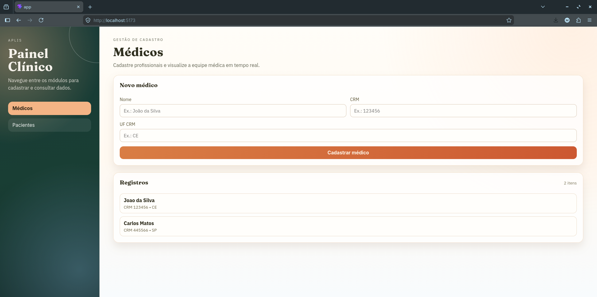
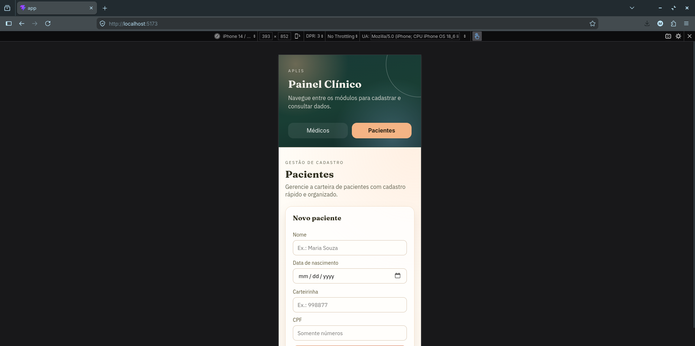
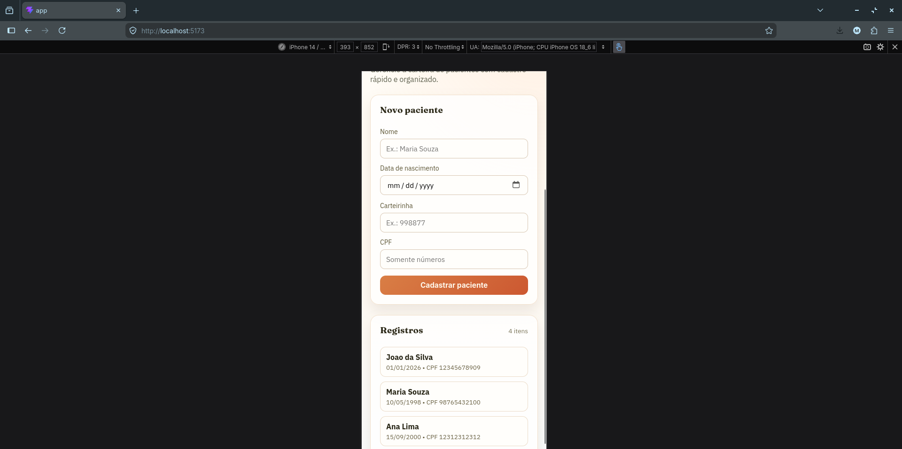
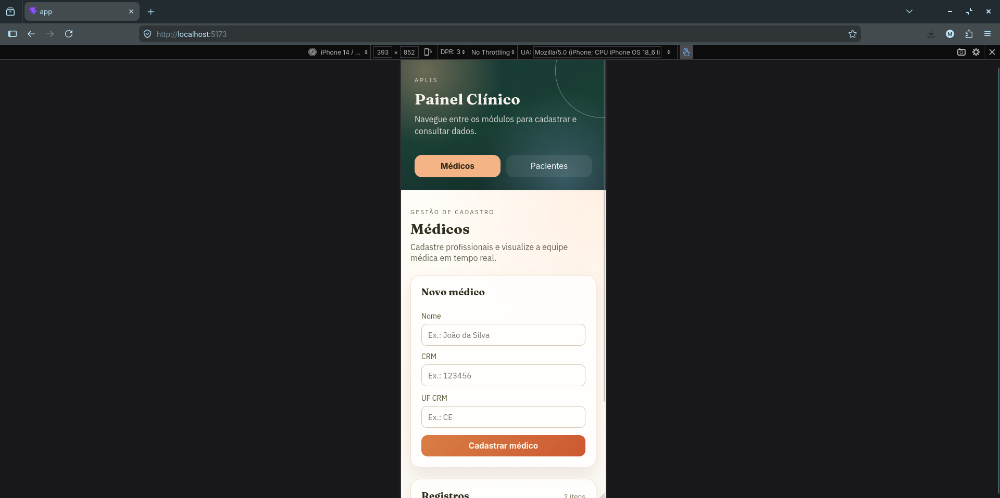

# Frontend - React + Vite

Este frontend foi feito para consumir as APIs de:
- medicos (backend PHP)
- pacientes (backend Node.js)

## Apresentacao do site
Esse frontend foi pensado para ser simples e direto.

Fluxo principal:
- escolher a tela no menu lateral
- preencher formulario
- salvar e ver o registro na lista

## Versao desktop
### Gerenciamento de médicos



### Gerenciamento de pacientes


## Responsividade
### Gerenciamento de Pacientes





### Gerenciamento de médicos



## O que essa tela faz
- Menu lateral para navegar entre medicos e pacientes
- Listagem de medicos
- Cadastro de medicos
- Listagem de pacientes
- Cadastro de pacientes
- Mensagens de sucesso/erro na tela

## Tecnologias usadas
- React
- Vite
- Zod (validacao de dados)
- Vitest (testes unitarios)

## Estrutura basica da pasta src
- `components`: componentes de tela
- `hooks`: logica de estado e chamadas
- `api`: funcoes para chamar backend
- `schemas`: validacoes com Zod

## Como rodar local (sem Docker)
1. Entrar na pasta:
```bash
cd app
```

2. Instalar dependencias:
```bash
npm install
```

3. Rodar o projeto:
```bash
npm run dev
```

Por padrao, abre em `http://localhost:5173`.

## Variaveis de ambiente
Este frontend usa:
- `VITE_API_MEDICOS_URL`
- `VITE_API_PACIENTES_URL`

Se nao definir, usa como padrao:
- `http://localhost:8000/api/v1/medicos`
- `http://localhost:3001/api/v1/pacientes`

## Testes
Rodar testes unitarios:
```bash
npm run test
```

## Build de producao
Gerar build:
```bash
npm run build
```

Preview do build:
```bash
npm run preview
```

## Rodando com Docker
Da raiz do projeto:
```bash
docker compose up -d --build
```

Frontend fica em:
- `http://localhost:5173`

## Observacao
Para funcionar completo, os dois backends precisam estar no ar junto com o banco.
